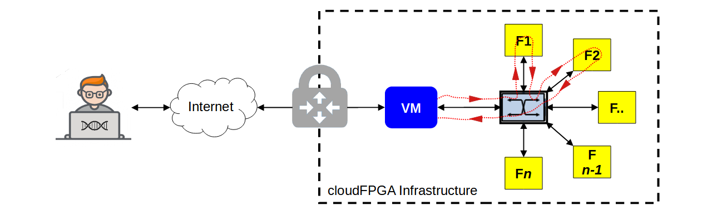

# cFp_HelloThemisto
A *Hello world* project built upon the shell **Themisto**.

## Overview

This project builds on the shell [Themisto](https://github.com/cloudFPGA/cFDK/blob/main/DOC/Themisto.md)
which is a shell with enhanced routing support for node-to-node communications. It exemplifies
the creation of a cluster consisting of one CPU and two FPGAs organized in a ring 
topology.

This setup is shown in the figure below and the scenario is as follows: a **virtual machine** (VM) 
sends data to a 1st FPGA (F1) via a UDP and/or a TCP network connection. When F1 is done with the 
processing of the incoming data, it forwards them to the next FPGA in the ring (i.e. F2), using 
the same network protocol as the incoming traffic. Finally, F2 which is the last FPGA of the 
ring, sends the data back to the VM after applying its own processing. 



**Info/Note**
- The shell [Themisto](https://github.com/cloudFPGA/cFDK/blob/main/DOC/Themisto.md) uses the
  concept of *MPI communicator* in which each cloudFPGA role application is assigned a unique 
  number to identify itself. This number is called the `node_rank` (or `rank` for short). It does 
  not change once the cluster is created and its value always ranges from 0 to *cluster-size-1*.
- The two FPGA applications of this project leverage both their `node_rank` and the `cluster_size`
  to determine the address of the next node in the following manner: 
  ```
      next_node_rank = (curr_node_rank + 1) % cluster_size
  ```
  As a result, the rudimentary size of the proposed ring-based cluster can be extended by simply 
  inserting more such FPGA application nodes into the ring.

## Shell-Role-Architecture
In **cloudFPGA** (cF), a user application is referred to as a **ROLE** and is integrated
along with a **SHELL** that abstracts the hardware components of the FPGA module.
The combination of a specific ROLE and its associated SHELL into a top-level design (**TOP**) is
referred to as a **Shell-Role-Architecture** (SRA).

The shell-role-architecture used by the project *cFp_HelloThemisto* is shown in the following 
figure. It consists of:
- a SHELL of type [_**Themisto**_](https://github.com/cloudFPGA/cFDK/blob/main/DOC/Themisto.md).
  This is the current default cloudFPGA shell because it supports **Partial Reconfiguration** (PR) 
  and can therefore be paired with a dynamically configured user role application. Additionally, the
  reconfiguration of such a role is performed by the *Themisto* shell itself, upon reception of a 
  new partial bitstream for the application via the TCP/IP network of the data center. The shell 
  *Themisto* includes the following building blocks:
  * a [10 Gigabit Ethernet (ETH)](https://github.com/cloudFPGA/cFDK/blob/main/DOC/ETH/ETH.md) sub-system,
  * a [Network Transport Stack (NTS)](https://github.com/cloudFPGA/cFDK/blob/main/DOC/NTS/NTS.md),
  * a [Network Abstraction Layer (NAL)](https://github.com/cloudFPGA/cFDK/blob/main/DOC/NAL/NAL.md),
  * a [FPGA Management Core (FMC)](https://github.com/cloudFPGA/cFDK/blob/main/DOC/FMC/FMC.md),
  * a [DDR4 Memory sub-system (MEM)](https://github.com/cloudFPGA/cFDK/blob/main/DOC/MEM/MEM.md),
  * a [Memory Mapped IO (MMIO)](https://github.com/cloudFPGA/cFDK/blob/main/DOC/MMIO/MMIO.md) sub-system.
- a ROLE of type [_**HelloThemisto**_](./DOC/README.md) which implements the set of TCP- and 
  UDP- applications used by this project.


<p align="center">Toplevel block diagram of the cFp_HelloThemisto project</p>
<br>

## How to build the project

The current directory contains the *sra* build script which handles all the required steps to 
generate the *partial bitstreams* needed for this project. During the build, both SHELL and 
ROLE dependencies are analyzed to solely re-compile and re-synthesize the components that 
must be recreated.
```
  $ SANDBOX=`pwd`  (a short for your working directory)
```

:Info/Warning: To generate the FPGA binary streams for this example cluster on your computer, you must be authorized to access the cloudFPGA infrastructure via VPN. This requires a cloudFPGA account that can be requested [here](https://github.com/cloudFPGA/Doc/tree/master/imgs/COMING_SOON.md).

#### Step-1: Clone and configure the project
```
  $ cd ${SANDBOX}
  $ git clone --recursive git@github.com:cloudFPGA/cFp_HelloThemisto.git
  $ cd cFp_HelloThemisto/cFDK
  $ git checkout main
  $ cd ..
```

### Step-2: Setup your environment
```
    $ cd ${SANDBOX}/cFp_HelloThemisto
    $ source env/setenv.sh
```
### Step-3: Add your cloudFPGA credentials

Create a file called `user.json` and add your cloudFPGA credentials in it. The credentials 
consist of the `username`, the `password` and the `projectname` that were provided to you when 
you registered.

```
  $ echo "{\"credentials\": {\"user\": \"YOUR_USERNAME\", \"pw\": \"YOUR_PASSWORD\" }, \"project\": \"YOUR_PROJECTNAME\"}" > user.json
```

### Step-4: Retrieve the latest shell

Use the command `./sra update-shell` to download the latest DCP shell from the *cloudFPGA Resource 
Manager* (cFRM).
```
  $ ./sra update-shell
  
  [cFBuild] Updated dcp of Shell 'Themisto' to latest version (2) successfully. DONE.
        (downloaded dcp to ${SANDBOX}/cFp_HelloThemisto/dcps/3_topFMKU60_STATIC.dcp)
```

### Step-5: Activate the 1st role (optional)

This project contains two roles but only one role can be active at a time. So we need to specify 
the current active role to build and implicitly deactivate the other one. This step is optional if 
you just cloned this project because the default active role is already set to `msg-ring-app`. 
```
  $ ./sra config use-role "msg-ring-app"
```

You can check the currently active role as well as the list of defined roles for this project with
the command:

```
  $ ./sra config show
  
  [sra:INFO] The following roles are currently defined:
  Role msg-ring-app in directory ${SANDBOX}/cFp_HelloThemisto/ROLE/1
  Role invertcase-ring-app in directory ${SANDBOX}/cFp_HelloThemisto/ROLE/2
  Current active role: msg-ring-app
```

### Step-6: Generate partial bitstream for the 1st role

Generate a partial bitstream for the role `msg-ring-app`with the command:

```
    $ ./sra build pr
```

After ~40 minutes, the generated files will be available in the directory
`${SANDBOX}/cFp_HelloThemisto/dcps`. The result should look like:

```
  $ cd ${SANDBOX}/cFp_HelloThemisto
  $ ls -al dcps/
  2_topFMKU60_impl_msg-ring-app_complete_pr.dcp
  3_topFMKU60_STATIC.dcp
  3_topFMKU60_STATIC.json
  4_topFMKU60_impl_msg-ring-app_pblock_ROLE_partial.bin
  4_topFMKU60_impl_msg-ring-app_pblock_ROLE_partial.bin.sig
  4_topFMKU60_impl_msg-ring-app_pblock_ROLE_partial.bit
  4_topFMKU60_impl_msg-ring-app_pblock_ROLE_partial_clear.bin
  4_topFMKU60_impl_msg-ring-app_pblock_ROLE_partial_clear.bit
  5_topFMKU60_impl_msg-ring-app_pblock_ROLE_partial.rpt
  pr_verify.rpt
```

### Step-7: Activate and generate the 2nd role

Set the active role to `invertcase-ring-app` and generate a partial bitstream for this 2nd role.
```
  $ ./sra config use-role "invertcase-ring-app"
  
  $ ./sra build pr
```

After another ~40 minutes, the following files will be added to the `./dcps` directory:

```
  $ cd ${SANDBOX}/cFp_HelloThemisto
  $ ls -al dcps/*invertcase*
  2_topFMKU60_impl_invertcase-ring-app_complete_pr.dcp
  4_topFMKU60_impl_invertcase-ring-app_pblock_ROLE_partial.bin
  4_topFMKU60_impl_invertcase-ring-app_pblock_ROLE_partial.bin.sig
  4_topFMKU60_impl_invertcase-ring-app_pblock_ROLE_partial.bit
  4_topFMKU60_impl_invertcase-ring-app_pblock_ROLE_partial_clear.bin
  4_topFMKU60_impl_invertcase-ring-app_pblock_ROLE_partial_clear.bit
  5_topFMKU60_impl_invertcase-ring-app_pblock_ROLE_partial.rpt
```

## How to deploy the cluster

### Step-8: Upload the generated bitstreams

Before we can deploy this cluster consisting of one CPU and two FPGAs, we first need to upload the 
newly generated PR bitfiles of our two roles. The below step-8a and step-8b cover the two possible 
options for uploading these bitstreams.  

#### Step-8a: Upload images with the GUI-API

The cloudFPGA resource manager provides a web-based graphical user interface to its API. It is 
available as a [Swagger UI](https://swagger.io/tools/swagger-ui/) at 
```http://10.12.0.132:8080/ui/#/```.

To upload your generated bitstreams, expand the Swagger menu *Images* and the operation
`[POST] /images/app_logic - Upload an image of type app_logic`. Then, fill in the requested fields 
as exemplified below.


Next, scroll down to the "*Response body* section of the server and write down the image `id` for
use in the next step.

[TODO] 

Repeat step-8a for the second bistream called `invertcase_ring_app`.

#### Step-8b: Upload image with the cFSP-API

[TODO] 

### Step-9: Request a cloudFPGA cluster and deploy it

Now that your FPGA images have been uploaded to the cFRM, you can request a cloudFPGA cluster to
be programmed and deployed with them. The below step-9a and step-9b will cover the two offered
options for creating a new cF cluster.

#### Step-9a: Create a cluster with the GUI-API

To create a new cluster via the GUI-API, point your web browser at
```http://10.12.0.132:8080/ui/#/```

Expand the *Swagger* menu `Clusters` and the operation
`[POST] /clusters - Request a cluster`. Then, provide username, password, project name and the 
details of the cluster as exemplified below.

[TODO] 

Next, scroll down to the server's response and write down the two "*role_ip*" addresses for later 
accessing your FPGA instances.

[TODO] 

#### Step-9b: Create a cluster with the cFSP-API

[TODO]

### Step-10: How to test the deployed cluster

As mentioned above, the role `msg-ring-app` always forwards the incoming traffic to the 
next node in the cluster ring without modifying it, while the role `invertcase-ring-app` toggles 
the character case of the received data before forwarding them to the next node. 

An easy way to exercise this traffic scenario is to open two terminals on the VM of the created 
cluster, and to use the *netcat* network utility (often abbreviated as `nc`) for reading from and 
writing to the cluster using TCP or UDP connections. With all the communications of this cluster 
going over the **UDP/TCP port 2718**, enter the following commands in the two terminals:  

Terminal 1 - Set `nc` in TCP transmission mode
```  
  $ ping <IP-FPGA-1>         # w/ IP-FPGA-1 = the IP address of the 1st FPGA (see step-9)
  $ nc   <IP-FPGA-1> 2718    # Add `-u` for a UDP connection 
```
Terminal 2 - Set `nc` in TCP listen mode
```  
  $ ping <IP-FPGA-2>         # w/ IP-FPGA-2 = the IP address of the 2nd FPGA (see step-9)
  $ nc -l 2718               # Add `-u` for a UDP connection
```

You can now type in some text in the 1st terminal, and this text should be echoed back with all its
characters inverted in the 2nd terminal.

:Info: Some firewalls may block network packets if there is not a connection to the remote machine/port. Hence, to get the *HelloThemisto* example to work, the following commands may be necessary to be executed (as root):
```
        $ firewall-cmd --zone=public --add-port=2718-2750/udp --permanent
        $ firewall-cmd --zone=public --add-port=2718-2750/tcp --permanent
        $ firewall-cmd --reload
```

### Step-11: For further experiments

Now that your cluster with one CPU and two FPGAs is operational, you may want to try and deploy a 
larger cluster at step-9 or extend the current cluster with the 
`[PUT] /clusters/{cluster_id}/extend - Add nodes to an existing cluster` menu of the GUI-API.

Depending on the combination of `msg-ring-app` and `invertcase-ring-app` roles in your extended 
cluster, the text of the 2nd terminal will have its characters inverted or not.
