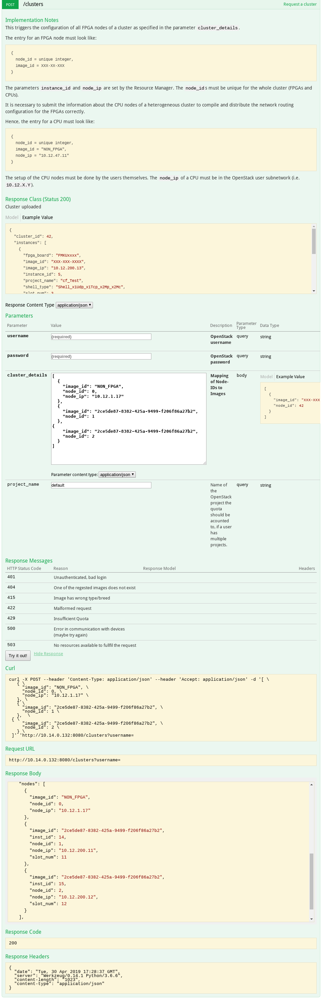

# cFp_Triangle
cloudFPGA project (cFp) for a triangle communication example

**Idea**:
```
   CPU  -->  FPGA  -->  FPGA 
    /\___________________|
```

All communication goes over the *UDP port 2718*. Hence, the CPU should run:
```bash
$ ping <FPGA 1>
$ ping <FPGA 2>
# Terminal 1
nc -u <FPGA 1> 2718
# Terminal 2
nc -lu 2817
```

Then the packets will be send from Terminal 1 to 2. 

The *Role* is the same for both FPGAs, 
because which destination the packets will have is determined by the `node_id`/`node_rank`
(VHDL port `piSMC_ROLE_rank`).

For distributing the routing tables, **`POST /cluster`** must be used.
The following depicts an example API call, assuming that the cFp_Triangle bitfile was uploaded as image`d8471f75-880b-48ff-ac1a-baa89cc3fbc9`:


